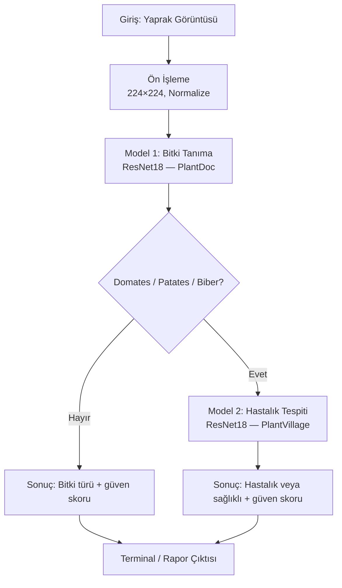

# Yaprak Analizi ile Bitki Tanıma ve Hastalık Tespiti Sistemi

Bu proje, yaprak görüntülerinden yararlanarak **bitki türünü tanıyan** ve seçili kültürler için **hastalık veya sağlık durumunu belirleyen** iki aşamalı bir derin öğrenme sistemidir. Sistem, transfer öğrenme tabanlı **ResNet18** mimarisi ile PyTorch ortamında geliştirilmiştir.

---

## Proje Özeti

Geleneksel tek modelli yaklaşımların aksine bu çalışmada **kademeli (cascade) bir mimari** benimsenmiştir:

1. **Aşama 1 — Bitki Tanıma:** Yaprak görüntüsü önce geniş kapsamlı bir sınıflandırıcıdan geçirilir. Bu model, farklı bitki türlerine ve yaprak tiplerine ait sınıfları ayırt eder (*PlantDoc* veri seti, 30 sınıf).
2. **Aşama 2 — Hastalık Tespiti:** Aşama 1 çıktısı **domates**, **patates** veya **biber** ile eşleşirse, görüntü ikinci bir modele yönlendirilir. Bu model, ilgili kültür için hastalık sınıflarını veya sağlıklı yaprak durumunu tahmin eder (*PlantVillage* tabanlı veri seti, 15 sınıf).

Bu yapı sayesinde hastalık modeli yalnızca klinik olarak anlamlı kültürlerde devreye girer; diğer bitkiler için yalnızca tür tanıma sonucu raporlanır. Böylece hem hesaplama maliyeti azalır hem de yanlış kültür–hastalık eşleştirmeleri sınırlandırılır.

---

## Sistem Mimarisi

Aşağıdaki şema, uçtan uca tahmin akışını özetlemektedir:



**Metinsel akış:**

```
Görüntü → Ön işleme → [Model 1: Bitki Tanıma] → Kültür kontrolü
                                              ↓
                         (Domates / Patates / Biber ise)
                                              ↓
                              [Model 2: Hastalık Tespiti] → Nihai rapor
```

| Bileşen | Dosya / Konum | Görev |
|---------|---------------|--------|
| Veri yükleme | `src/dataset.py` | PyTorch `Dataset` ve `DataLoader`, veri artırımı, stratified bölme |
| Eğitim | `src/train.py` | İki modelin transfer öğrenme ile eğitimi |
| Değerlendirme | `src/evaluate.py` | Test accuracy, macro F1, confusion matrix |
| Tahmin | `src/predict.py` | İki aşamalı canlı çıkarım (inference) |
| Yapılandırma | `config.yaml` | Hiperparametreler ve yol tanımları |

---

## Model ve Eğitim Stratejisi

### Mimari

- **Omurga (backbone):** `torchvision.models.resnet18(pretrained=True)` — ImageNet üzerinde önceden eğitilmiş ağırlıklar.
- **Sınıflandırma katmanı:** Orijinal `fc` katmanı, veri setindeki sınıf sayısına göre yeniden tanımlanır (`nn.Linear`).

Her iki model (bitki ve hastalık) için **aynı eğitim stratejisi** uygulanır:

### Aşamalı Transfer Öğrenme

| Dönem | Epoch aralığı | Eğitilen katmanlar | Öğrenme oranı | Açıklama |
|-------|---------------|-------------------|---------------|----------|
| **Frozen FC** | 1 – 5 | Yalnızca `fc` (tam bağlı katman) | 0,001 | ResNet18 gövdesi dondurulur; önceden öğrenilmiş özellik çıkarıcı korunur, yeni sınıflandırıcı başlığı öğrenilir. |
| **Fine-tune** | 6 – 25 | Tüm ağ | 0,0001 | Gövde çözülür; düşük öğrenme oranı ile uçtan uca ince ayar yapılır. |

### Early Stopping

- İzlenen metrik: **doğrulama kaybı (validation loss)**.
- **Sabır (patience):** 5 epoch.
- Doğrulama kaybı ardışık 5 epoch boyunca iyileşmezse eğitim durdurulur.
- En düşük validation loss değerine sahip model `best_model.pt` olarak kaydedilir.

### Veri artırımı (yalnızca eğitim)

- `RandomHorizontalFlip`, `RandomRotation(15°)`, `ColorJitter`
- Doğrulama ve test: yalnızca yeniden boyutlandırma ve ImageNet normalizasyonu

---

## Hiperparametre Tablosu

Aşağıdaki değerler `config.yaml` dosyasında tanımlıdır ve eğitim sürecinde kullanılır.

| Parametre | Değer | Açıklama |
|-----------|-------|----------|
| Mimari | ResNet18 | Önceden eğitilmiş omurga |
| Görüntü boyutu | 224 × 224 | Giriş tensör boyutu |
| Batch size | 32 | Mini-batch boyutu |
| Epoch (maks.) | 25 | Toplam epoch üst sınırı |
| Frozen FC öğrenme oranı | 0,001 | Epoch 1–5 |
| Fine-tune öğrenme oranı | 0,0001 | Epoch 6–25 |
| Early stopping patience | 5 | Validation loss iyileşmezse dur |
| Optimizer | Adam | Eğitilebilir parametreler üzerinde |
| Rastgele tohum (seed) | 42 | Tekrarlanabilirlik |

---

## Veri Setleri

| Model | Klasör | Format | Sınıf sayısı |
|-------|--------|--------|--------------|
| Bitki tanıma | `data/plant_doc/` | YOLO tabanlı (train / valid / test) | 30 |
| Hastalık tespiti | `data/plant_disease/` | ImageFolder (düz sınıf klasörleri) | 15 |

> **Not:** `data/` klasörü boyutu nedeniyle `.gitignore` ile sürüm kontrolüne dahil edilmemiştir. Veri setleri yerel ortamda ayrıca indirilip yerleştirilmelidir. `plant_disease` için otomatik **%70 train / %15 validation / %15 test** stratified bölme uygulanır.

---

## Proje Yapısı

```
.
├── src/
│   ├── dataset.py      # Veri seti ve DataLoader
│   ├── train.py        # Model eğitimi
│   ├── evaluate.py     # Test metrikleri ve confusion matrix
│   └── predict.py      # İki aşamalı tahmin
├── data/               # Veri setleri (gitignore)
├── outputs/
│   ├── plant_model/    # best_model.pt
│   ├── disease_model/  # best_model.pt
│   └── figures/        # Eğitim ve değerlendirme grafikleri
├── docs/images/        # Dokümantasyon görselleri
├── config.yaml
├── requirements.txt
└── README.md
```

---

## Kurulum

```bash
python -m venv venv
source venv/bin/activate          # Windows: venv\Scripts\activate
pip install -r requirements.txt
```

GPU destekli PyTorch kurulumu için: [https://pytorch.org/get-started/locally/](https://pytorch.org/get-started/locally/)

---

## Eğitim ve Değerlendirme

**Bitki tanıma modeli:**

```bash
python -m src.train --mode plant
python -m src.evaluate --mode plant
```

**Hastalık tespiti modeli:**

```bash
python -m src.train --mode disease
python -m src.evaluate --mode disease
```

Değerlendirme çıktıları: test accuracy, macro F1-score ve `outputs/figures/` altında confusion matrix grafiği.

---

## Kullanım Kılavuzu — Canlı Tahmin

Eğitilmiş modellerle dışarıdan verilen bir yaprak görüntüsünü analiz etmek için:

```bash
python -m src.predict --image <resim_yolu>
```

**Örnek:**

```bash
python -m src.predict --image ornek_yaprak.jpg
```

### Örnek terminal çıktısı

```
========================================================
          Yaprak Analizi — İki Aşamalı Tahmin
========================================================

Görüntü : /path/to/ornek_yaprak.jpg
Cihaz   : cpu

[Aşama 1 — Bitki / yaprak türü]
  Tahmin    : Potato leaf late blight
  Güven     : 32.27%
  Kültür    : Patates (hastalık analizi uygulanacak)
  Alternatifler:
    - Tomato Septoria leaf spot (27.75%)
    - Apple rust leaf (8.44%)

[Aşama 2 — Hastalık / sağlık durumu]
  Tahmin    : Potato — Early blight
  Güven     : 99.99%
  Durum     : Hastalık belirtisi tespit edildi
  Alternatifler:
    - Potato — Late blight (0.01%)
    - Potato — healthy (0.00%)

--------------------------------------------------------
Özet: Potato leaf late blight (32.3%) → Potato — Early blight (100.0%)
      (patates için hastalık analizi tamamlandı)
--------------------------------------------------------
```

Domates, patates veya biber **dışındaki** bitkilerde yalnızca Aşama 1 sonuçları gösterilir; hastalık modeli çalıştırılmaz.

---

## Kullanılan Teknolojiler

- **Python 3.10+**
- **PyTorch** ve **torchvision** (ResNet18, veri dönüşümleri)
- **scikit-learn** (metrikler, stratified bölme, confusion matrix)
- **matplotlib** (eğitim ve değerlendirme grafikleri)
- **PyYAML** (yapılandırma yönetimi)
- **Pillow** (görüntü okuma)

---

## Sonuç

Bu proje, yaprak görüntüleri üzerinden **önce bitki türünü tanıyan**, ardından uygun kültürlerde **hastalık veya sağlıklı durumu raporlayan** modüler bir derin öğrenme hattı sunmaktadır. ResNet18 tabanlı transfer öğrenme, aşamalı dondurma–ince ayar stratejisi ve early stopping ile eğitim verimliliği ve genelleme dengesi hedeflenmiştir. `src/predict.py` modülü, sistemin uçtan uca kullanımını tek komutla mümkün kılar.
